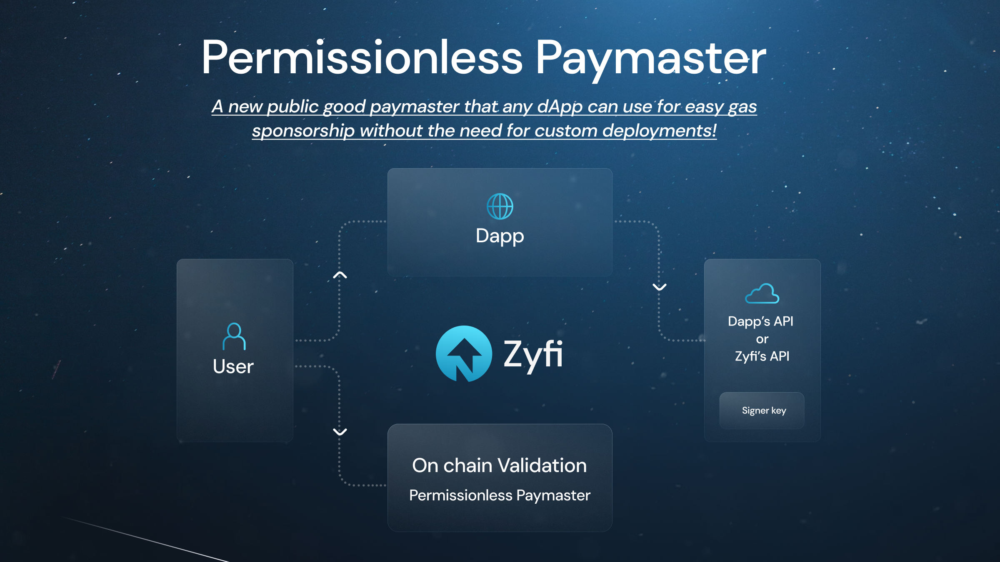

# Zyfi - Permissionless Multi Signer Paymaster
A singular permissionless multi-signer paymaster allowing multiple dapps to seamlessly sponsor gas for their users through signature verification. 

This project is scaffolded with [zksync-cli](https://github.com/matter-labs/zksync-cli).



## Overview
- This paymaster is a signature based paymaster, it sponsor gas fees for any user transaction if valid signature is provided.
- Any Dapps can integrate this paymaster by simply depositing gas funds and adding a signer address. 
- Signature is validated against the added signer address, and gas funds for sponsorship are deducted from Dapp's account(Manager) as per usage upon correct validation. 
- Signature signing shall be done off-chain as per requirement by each Dapp.

- "**Permissionless**" - Multiple Dapps can use this paymaster without any restrictions. Deposit gas funds, sponsor gas, withdraw at any time.
- "**Multi-signer**" - It allows Dapps to add multiple signers whose signature will be verified before gas sponsorship for the users. Ensuring gas funds are only accessed if Dapp approves off-chain.

- There are 2 primary actors involved:
    - **Manager**: Fully managed by the Dapp, responsible for depositing/withdrawing gas funds, and adding or removing signer addresses. 
    - **Signers**: Managed by the dApp or a trusted third party like Zyfi’s API. A signer’s signature is required to access gas funds by the Dapp's user.

Please check [technical-specs.md](./technical_specs.md) and our [documentation](https://docs.zyfi.org/) for detailed information & integration.

### Benefits

This signature based implementation allows the following features:
- Protocols can implement **any business logic** to decide their which users should be provided gas sponsorship.
- No need for Dapps to to be dependant on 3rd party for paymaster services.
- No need for Dapps to deploy paymaster with custom business logic.
- Easy integration to your Dapp with optional Zyfi API support available.

### Contract address
Network | Address
| --- | --- |
| ZKsync Mainnet | 0xF8dc9e1a5C6cdC9aBC0FbF2F7E08Fd40606cFdB8 |
| ZKsync Sepolia Testnet | 0xF8dc9e1a5C6cdC9aBC0FbF2F7E08Fd40606cFdB8 |

## Project structure

- `/contracts`: smart contracts.
- `/deploy`: deployment and contract interaction scripts.
- `/test`: test files

## Commands

- `npx zksync-cli dev start` to start a local node. It can be checked with `docker logs --follow zkcli-in-memory-node-zksync-1`
- `yarn install` will install the dependencies.
- `yarn compile` will compile the contracts.
- `yarn test` will run tests. **Check test requirements below.**
- `npx zksync-cli dev start` can be used to set up an explorer or dapp for local tests

### Environment variables

In order to prevent users to leak private keys, this project uses environment variables. It's used to load the wallet private key, required to run the deploy and interact script.

To use it, rename `.env.example` to `.env` and enter your private key.

```
WALLET_PRIVATE_KEY=0x123cde574ccff....
SIGNER_PRIVATE_KEY=0x123cde574ccff....
```


## Local Testing

### Install dependencies
- Node version 18 or above.
```
yarn install
```
### - Hardhat
```
yarn test
```

### - Fork environment

#### 1. Start inMemoryNode with Era_test_node in terminal. [See installation here](https://docs.zksync.io/build/test-and-debug/in-memory-node#install-and-set-up-era_test_node) 

```
era_test_node fork mainnet
```
#### 2. Run below command in another terminal
```
yarn test-local
```

## Links

- [Technical Specs](./technical_specs.md)
- [Zyfi portal](https://zyfi.org/)
- [Documentation](https://docs.zyfi.org/)