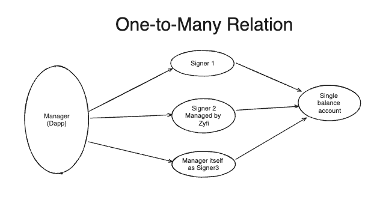
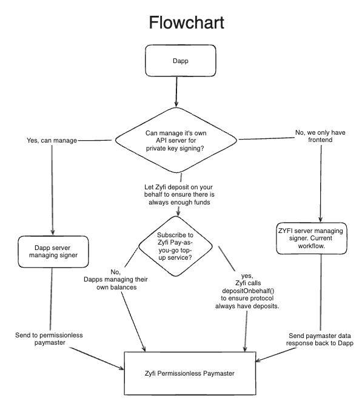
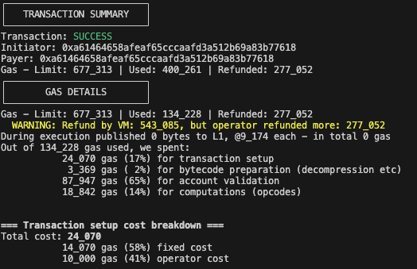
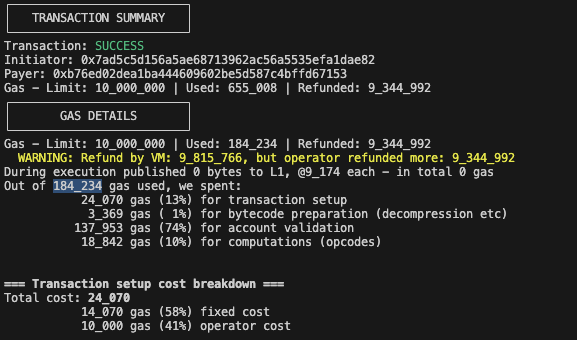

## Assets in scope 
- ./contracts/paymasters/PermissionlessPaymaster.sol

## Permissionless Multisigner Paymaster Overview
- This paymaster aims to be a public good singular paymaster for any dapps/accounts to provide 100% gas sponsorship to users/related accounts by gatekeeping through signature verification in a permissionless way. 
- Any account(manager) can deposit funds that will sponsor gas and also set a signer upon which signature validation is done. 
- The signer can be maintained by the manager or a trusted party like Zyfi. The manager can itself be a signer.
- The signer signs the data (e.g users address, gas price, expiration time) and provides a signature. This is expected to be managed off-chain. 
- The gas sponsorship from the manager's funds can only be accessed if the signature provided by the user is valid. 
- The amount is then deducted from the manager account associated to the signer. 
- Hence, this is a one stop solution for a signature based gated paymaster, available to the whole zkSync ecosystem

### One-to-many relationship between signers and managers


### Flowchart 


## Why is the paymaster needed?  What problem does it solve? 
- The main problem solved by this paymaster is allowing Dapps to have signature based gate-keeping for gas sponsoring without the need to deploy new paymaster itself. 
- This allows Dapps to have custom gas sponsorship logic embedded in their back-end server. Being signature based, the paymaster does not need on-chain oracles.
- It also allows Dapps to have the flexibility of managing multiple signers.

## Target Audience 
- Major target audience : Dapps/Protocols looking to sponsor gas for their users using custom off-chain logic. 
- User accounts who wants to manage gas sponsorship for their related accounts. 

## User roles 
- Manager, Signers, Users, Zyfi Token Rescue Account

### Manager
1. Manager is the address managed by the Dapp/protcol or individual for gas sponsorship.
2. One-to-many relationship with Signers, i.e. A manager can add or remove multiple signers as desired. 
3. Manages funds for gas sponsorship. A manager can deposit/withdraw as needed. 
4. Manager can itself be a signer. 
5. All signers are allowed access to the funds added by manager. 

### Signers 
1. Signers are the addresses whose signatures are verified for gas sponsorship. Basically, only signers can allow gas sponsorship in the paymaster.
2. Signers are added and removed by the manager. Signers are expected to trusted by the manager.
3. Only one manager is related to a signer at a time. 
4. The signers and signing part is managed offline by Dapps or can even be delegated to the Zyfi API for convenience for the Dapp/protocol.
5. A signer can revoke itself if required. 

### Users 
1. Users are the end-users that will receive a sponsored transaction from the DApp to sign. They will be easily able to verify that the transaction does not require any gas payment from their side.

### Zyfi Token Rescue Account 
1. Zyfi managed address to rescue any ERC-20 token (other than ETH) that mistakenly is sent to the paymaster address.

## Signature 

#### EIP-712 type signature
- To allow flexibility over time if Zyfi ever decides to create a dashboard for manager and signers to sign. Using this EIP, metamask like wallets can represent signature data in a more readable format. 

#### What data would the signers sign? 
```
(_domainSeparator +
hash(
    SIGNATURE_TYPEHASH,
    _from,
    _to,
    _expirationTime,
    _maxNonce,
    _maxFeePerGas,
    _gasLimit
))
```

## Refunds
- Zksync refunds the amount for the unused gas initially charged to the paymaster.
- In this paymaster, refunds are managed through internal `updateRefund` functions.
- Due to `_maxRefundedGas` in `postTransaction()` not being accurate, the refund is processed in the next transaction. 

## Main invariants

1. The paymaster balance is always greater than or equal to the sum of the manager balances in paymaster at any given point of time. 

```
Balance_of_paymaster ≥ (Σ Manager_Balances_in_paymaster)
```

## Area of concerns 

1. Manipulation of update refunds. For eg: Inflation of `previousTotalBalance` in any manner or managers are refunded more than deserving amount. 
2. Gas griefing attacks that drains the paymaster. For eg: Invalid signature returns magic = bytes4(0) instead of reverting. Could this be used to drain paymaster funds in the future? 
3. Funds being stuck in  the paymaster.
4. Any particular way that affects the reputation of paymaster in future as mentioned [here](https://docs.zksync.io/build/developer-reference/account-abstraction/paymasters#paymaster-verification-rules).
5. Signature replay attacks.

## Known issues/ Expected behaviour

#### 1. Dependency on `transaction.nonce`:
- Zksync might shift to non-sequential arbitary nonce ordering which could lead to signature replay attacks. 
- Zyfi will be closely watching this development and eventually will notify transfer funds to new version of paymaster. 
- The main reason to be dependent on `transaction.nonce` is to save gas and allow flexibility to same users across multiple dapps using the same paymaster. Curious to discuss more on this. 

#### 2. Griefing attacks while adding signers
- `depositAndAddSigner`, `addSigner`, `batchAddSigners` are subject to griefing attacks. 
- While this an in-evitable scenario, we have `selfRevokeSigner` to minimalize the impact. Since signers can be any address, the impact reduces further.  

#### 3. Eth sent using self-destruct is rewarded to `previousManager`. 
- Expected behaviour

#### 4. Eth sent by self-destructing manager to paymaster using paymaster itself are stuck forever.
- Expected behaviour

#### 5. No 2-step transfer for `ZYFI_RESCUE_TOKEN_ADDRESS` 
- The chances of tokens mistakenly sent to the paymaster are already low. 
- Hence, we have decided to keep the design simple.

## Gas 

- Simple mint transaction : 134_228
- 
---
- With Paymaster overhead : 184_234 (50k difference)

