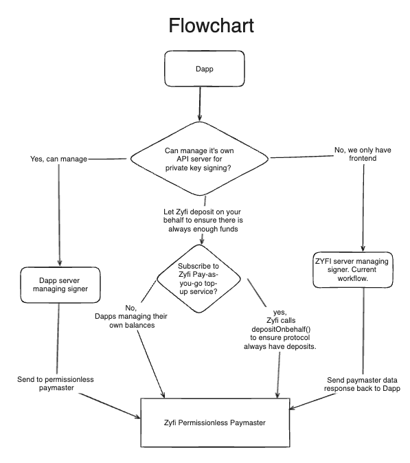
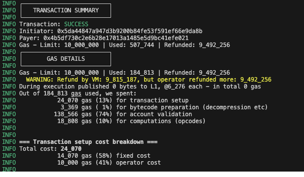

## Permissionless Multisigner Paymaster
- This paymaster aims to be a public good singular paymaster for any dapps/accounts to provide 100% gas sponsorship to users/related accounts by gatekeeping through signature verification in a permissionless way. 
- Any account(manager) can deposit funds that will sponsor gas and also set a signer upon which signature validation is done. 
- The signer can be maintained by the manager or a trusted party like Zyfi. The manager can itself be a signer.
- The signer signs the data (e.g users address, gas price, expiration time) and provides a signature. This is expected to be managed off-chain. 
- The gas sponsorship from the manager's funds can only be accessed if the signature provided by the user is valid. 
- The amount is then deducted from the manager account associated to the signer. 
- Hence, this is a one stop solution for a signature based gated paymaster, available to the whole zkSync ecosystem

### One-to-many relationship between signers and managers


### Flowchart 


## Why is the paymaster needed?  What problem does it solve? 
- The main problem solved by this paymaster is allowing Dapps to have signature based gate-keeping for gas sponsoring without the need to deploy new paymaster itself. 
- This allows Dapps to have custom gas sponsorship logic embedded in their back-end server. Being signature based, the paymaster does not need on-chain oracles.
- It also allows Dapps to have the flexibility of managing multiple signers.

## Target Audience 
- Major target audience : Dapps/Protocols looking to sponsor gas for their users using custom off-chain logic. 
- User accounts who wants to manage gas sponsorship for their related accounts. 

## User roles 
- Manager, Signers, Users, Zyfi Treasury Account

### Manager
1. Manager is the address managed by the Dapp/protcol or individual for gas sponsorship.
2. One-to-many relationship with Signers, i.e. A manager can add or remove multiple signers as desired. 
3. Manages funds for gas sponsorship. A manager can deposit/withdraw as needed. 
4. Manager can itself be a signer. 
5. All signers are allowed access to the funds added by manager. 

### Signers 
1. Signers are the addresses whose signatures are verified for gas sponsorship. Basically, only signers can allow gas sponsorship in the paymaster.
2. Signers are added and removed by the manager. Signers are expected to trusted by the manager.
3. Only one manager is related to a signer at a time. 
4. The signers and signing part is managed offline by Dapps or can even be delegated to the Zyfi API for convenience for the Dapp/protocol.
5. A signer can revoke itself if required. 

### Users 
1. Users are the end-users that will receive a sponsored transaction from the DApp to sign. They will be easily able to verify that the transaction does not require any gas payment from their side.

### Zyfi Treasury
1. Zyfi Treasury address to rescue any ERC-20 token (other than ETH) that mistakenly is sent to the paymaster address.
2. To collect markup fee. This functionality is optional for Zyfi API only, Dapps are expected to set the markupPercent to 0 unless they want to donate.

## Signature 

#### EIP-712 type signature
- To allow flexibility over time if Zyfi ever decides to create a dashboard for manager and signers to sign. Using this EIP, metamask like wallets can represent signature data in a more readable format. 

#### What data would the signers sign? 
```
(_domainSeparator +
hash(
    SIGNATURE_TYPEHASH,
    _from,
    _to,
    _expirationTime,
    _maxNonce,
    _maxFeePerGas,
    _gasLimit,
    _markupPercent
))
```
#### _from :
- The user address the signer wants to sponsor. Taken from "transaction.from"

#### _to : 
- The target contract user address is interacting to. Taken from "transaction.to". 
- Design question: Worst case scenario if signers have ability to make "transaction.to" optional in signature. 

#### _expirationTime :
- Timestamp post which the signature expires.
Taken from innerInputs provided by signer

#### _maxNonce :
- Nonce of the user post which signature cannot be replayed. Taken from innerInputs provided by signer
- Allows flexibility for Dapps to allow replaying signature since transaction.to(Dapp's contract) will be same.

#### _maxFeePerGas : 
- Max gas price. To avoid gas price inflation attacks.
Taken from transaction.maxFeePerGas

#### _gasLimit :
- To avoid gas manipulation attacks.
Taken from transaction.gasLimit 

#### _markupPercent :
- Optional markup to be added by signer. 
Taken from innerInputs
- If markupPercent cannot exceed 100% of required eth for transaction. If markupPercent > 100%, then it is set to 100%.


## Refunds
- Zksync refunds the amount for the unused gas initially charged to the paymaster.
- In this paymaster, refunds are managed through internal `updateRefund` function.
- Due to `_maxRefundedGas` in `postTransaction()` not being accurate, **the refund is processed in the next transaction**. 


## Gas 
- Simple mint transaction : Transaction total gas : 390_107 | Gas used : 134_228
> 
---
- With Paymaster overhead : Transaction total gas : 667_043 | Gas used : 182_490 (48k difference)
> 
---
- With Paymaster overhead and markup : Transaction total gas : 466_751 | Gas used : 192_922 (58k difference)
> 